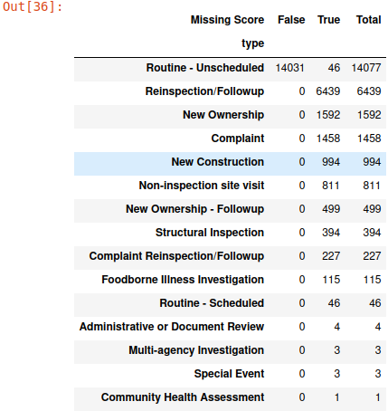

# Pandas Cookbook
## I. Basic Data Structures
### Series
```
pd.Series([...], index=[...])
```
* Single Label/Labels: `s["a"] s["a","c"]`
* Filtered: boolean index: `s>0` filtered results: `s[s>0]`
### DataFrame
```
pd.DataFrame(data, index, columns)
```

e.g. 

```
pd.DataFrame([1, 2, 3], columns=["Numbers"])
```

```
pd.DataFrame([[1, "one"], [2, "two"]], columns=["Numbers", "Description"])
```

```
pd.DataFrame({"Fruit":["Strawberry", "Orange"],"Price": [5.49, 3.99]})
```

```
pd.DataFrame([{"Fruit":"Strawberry", "Price":5.49},{"Fruit":"Orange", "Price":3.99}])
```

```
s_a = pd.Series(["a1", "a2", "a3"], index = ["r1", "r2", "r3"])
s_b = pd.Series(["b1", "b2", "b3"], index = ["r1", "r2", "r3"])
pd.DataFrame({"A-column":s_a, "B-column":s_b})
```

All the object named with 'datas' are DataFrame.
All the object named with 'series' are Series.

## II. Indices Trick
* Modifying Indices: `datas.set_index("label", inplace=True)`
* Resetting Indices to default list of ints: `datas.reset_index(inplace=True)`

## III. Slicing
* Taking first x rows or last x rows: `datas.head(x) datas.tail(x)`
* loc:
	``` 
	datas.loc[index=[],labels=[]] 
	
	datas.loc[index=...,labels=[]]
	
	datas.loc[index=[],labels=...]  (become Series)
	 
	datas.loc[index=...,labels=...] (become Value)
	```
	
	* ':' can represent taking all rows or columns
	* 'x:y' is inclusive of the right hand side of the slice
	
*  iloc:
    ``` 
	datas.iloc[index=[],labels_index=[]] 
	
	datas.iloc[index=...,labels_index=[]]
	
	datas.iloc[index=[],labels_index=...]  (become Series)
	 
	datas.iloc[index=...,labels_index=...] (become Value)
	```
	* ':' can represent taking all rows or columns
	* 'x:y' is exclusive of the right hand side of the slice 

* []:
	* Context sensitive:
		* A slice of row numbers.
      	* A list of column labels.
      	* A single column label. (become Series)
     * A single row number is not allowed!!!!!!
     * 'x:y' is exclusive of the right hand side of the slice (cuz it is done by iloc)
     * Most used in selecting columns! Often used!

* Extracting the list of row and column labels: `datas.index` `datas.columns`
* Extracting all values of the DataFrame in the form of numpy.narray: `datas.values`

## IV. Conditional Selection

Both [] and loc can receive boolean array: list & Series. Have the same effect.

E.g

```
datas[datas["Sex"] == "F"]
datas.loc[datas["Sex"] == "F"]
datas[(datas["Sex"] == "F") & (datas["Year"] < 2000)]
datas.loc[datas["Count"] > 250, ["Name", "Count"]].head(3)
```

* .isin:
  ```
  required_list = [...]
  datas[datas["column_label"].isin(required_list)]
  ```

* .str.startswith:
  ```
  datas[datas["column_label"].str.startswith("...")]
  ```
	* "..." can either be a string or a char
	* It's capital sensitive!

* .groupby.filter: check `.groupby`

## V. Handy Utility Functions
* Both DataFrame and Series support Numpy
  e.g.  `np.mean` `max` `min`
  
* shape/size:
  ```
  datas.shape
  datas.size
  ```
  
* descibe():
  ```
  datas.descibe()
  ``` 
  * returns a DataFrame of statistical values
  * index will become: `count mean std min 25% 50% 75% max`
  ```
  series.descibe()
  ``` 
  * returns a Series of statistical values
  * index will become: `count unique top freq`
  
* sample():
  ```
  datas.sample(num, replace=False)
  ```
  * num: the number you want to sample / frac: the rate you want to sample 
  * replace: By default, without replacement(won't put samples back). You can set `replace = True` for replacement
  * weights: Decide the weight of being selected of each row or column. 
    * If a string is taken, the string is required to be a label name of the DataFrame. The weights of the rows will be decided by their value under that label. 
    * Else if a Series is taken, it is not required to match the shape of the DataFrame. The Series should be: `pd.Series(weights:[...], index=[...])` It will first concat it with the DataFrame. If an index doesn't exist, the weight of which will be `nan`. Then the existing weights will be normalized again. 
  * random_state: If multiple sample process share a same value of this parameter, all of the samples after the first one will be the same as the first sample.
  * axis: By default 0: row sampling, 1: col sampling
  * can only do SRS
  
* (Series).value_counts():
  ```
  series.value_counts(sort = True, ascending = False)
  ```
  return a Series counts the number of occurrences of a each unique
value in the original Series

* (Series).unique():
  ```
  series.unique()
  ```
  return an array, including every unique value of the Series

* sort_values():
  ```
  series.sort_values()
  datas.sort_values(by="label_name", ascending = True)
  datas.sort_values(by=["A","B"], ascending = True)
  datas.sort_values("label_name", key=func, ascending=False)
  ```
  * by: Label names, depends which to sort
  * key: a function(can be lambda), sort according to this transform of the original data, e.g. `lambda x: x.str.len()` 
  * ascending: By default True: sort from min to max. False: sort from max to min
  * Series return Series, DataFrame return DataFrame

* (Series).map():
  ```
  def func(x):
   ...
   return mapped_x
   
  datas["new_col_name"]=datas["label_name"].map(func)
  ```

  Used to create a projection (original data->transformed data), return Series. The projection is defined with an arbitrary function.

* (DataFrame).query():
  ```
  datas_query = datas.query('boolean_expression')
  male_2020_babynames = babynames.query('Sex == "M" and Year == 2020') # example
  ```
  Faster filtering with boolean array.

* .astype():
  ```
  datas["new_col_name"] = datas["col"].astype(float)
  ```
  Change the dtype of the data in the DataFrame.

* pd.get_dummies():
  ```
  pd.get_dummies(data, prefix=None, prefix_sep='_', dummy_na=False, columns=None, sparse=False, drop_first=False, dtype=None)
  
  >>> df = pd.DataFrame({'A': ['a', 'b', 'a'], 'B': ['b', 'a', 'c'],
                         'C': [1, 2, 3]})
                         
  >>> pd.get_dummies(df, prefix=['col1', 'col2'])
      C  col1_a  col1_b  col2_a  col2_b  col2_c
   0  1       1       0       0       1       0
   1  2       0       1       1       0       0
   2  3       1       0       0       0       1
   
  dummies = pd.get_dummies(datas['day']) 
  ```
  return one-hot encoded DataFrame

## VI. Adding, Modifying, and Removing Columns/Rows
 
* Adding a column:
  ```
  datas["new_col_name"]= ... (Value or Series)
  datas.assign(**kwargs)
  
  >>> datas.assign(temp_f=lambda x: x['temp_c'] * 9 / 5 + 32,
                   temp_k=lambda x: (x['temp_f'] +  459.67) * 5 / 9)
             temp_c  temp_f  temp_k
  Portland    17.0    62.6  290.15
  Berkeley    25.0    77.0  298.15
  ```
  * **kwargs: dict of {str: callable or Series}

* Removing a column/row:
  ```
  datas.drop("label_name", axis=1)
  datas.drop(index, axis=0)
  ```
  * axis: By default 0: row, 1: col
  * level: Decide in which level the required label is. This is used to drop rows/cols from multi-index DataFrame.
  * can be used to drop rows or cols. 
    e.g.
    ```
    datas.drop([1,2,3], axis=0)
    datas.drop(list(datas.index)[0:3], axis=0)        # exclusive of RHS
    datas.drop(["A","B","C"], axis=1)
    datas.drop(list(datas.columns)[0:3], axis=1)      # exclusive of RHS  
    ```

* Drop repeated rows:
  ```
  datas.drop_duplicates(subset=[...], keep, inplace)
  ```
  * subset: A subset of labels, drop repeated rows according to their values under these labels
  * keep: 'first': keep the first one, 'last': keep the last one, False: drop all repeated rows
  * inplace: default False: return a copy, True: do drop on the original DataFrame

* Renaming a column:
  ```
  datas.rename(columns={"old_label": "new_label"})
  ```

## VII. Groupby

* .groupby().agg()
  ```
  def func(x):
    ...
    return y
  result_table = datas.groupby("label_name").agg(func)
  ```
  * Calling .groupby() generates DataFrameGroupBy objects
  * Each subframe contains all rows of the same value under "label_name"
  * All datas will either be thrown away or be calculated according to the aggregation in the returned result.
  * Note: The thrown away part will cause warning, and in the future updates it will simply crash. To fix this, one must use an explicit representation. e.g.
    ```
    rtp_table = female_babynames.groupby("Name")[["Count"]].agg(ratio_to_peak)
    # return DataFrame, keep the label "Count"
    rtp_table = female_babynames.groupby("Name")["Count"].agg(ratio_to_peak)
    # return Series, won't keep the label "Count"
    ```
  * If the "label_name" in groupby is replaced with a list ["labels"], then return a multi-indexed frame.

* .groupby().sum()
  ```
  == .groupby().agg(sum)
  ```

* .groupby().max()
   ```
   == .groupby().agg(max)
   ```
* .groupby().idxmax()
  ```
  == .groupby().agg(idxmax)
  ```
* .groupby().size()
  ```
  == .groupby().agg(size)
  ```
* .groupby().filter()
  ```
  datas.groupby().filter(f), where f = lambda x:x["label_name"].sum() > 10 # example
  ```
  * f: A function takes a DataFrame as input, returns True or False, filter will apply the function to subframes and return those rows in True groups with the sequence in the original DataFrame.

* .groupby(as_index): 

  A bool parameter, decides whether the groupby column to be index of the result or not.

## VIII. Pivot Tables

```
datas_pivot = datas.pivot_table(
index='Year',# rows (turned into index)
columns='Sex',# column values
values=['Count', 'Name'],
aggfunc=func, # group operation
)
# example
```
```
ins["count"] = 1
ins_pivot = ins.pivot_table(index="type", columns="year", values="count", aggfunc={"count":sum}, fill_value=0)
ins = ins.drop("count", axis=1)
ins_pivot["Total"] = ins_pivot.sum(axis=1)
ins_pivot_sorted = ins_pivot.sort_values(by="Total", ascending=False)
ins_pivot_sorted
```

```
ins["Missing Score"] = (ins['score'] == -1)
ins["count"] = 1
ins_missing_score_pivot = ins.pivot_table(index="type", columns="Missing Score", values="count", aggfunc={"count":sum}, fill_value=0)
ins = ins.drop("Missing Score", axis=1)
ins = ins.drop("count", axis=1)
ins_missing_score_pivot["Total"] = ins_missing_score_pivot.sum(axis=1)
ins_missing_score_pivot = ins_missing_score_pivot.sort_values(by="Total", ascending=False)
ins_missing_score_pivot
```


## IX. Joining Tables

* pd.merge()
  ```
  pd.merge(left=DataFrame, right=DataFrame, left_on="label_name", right_on="label_name")
  ```
  * left: The DataFrame on the LHS
  * right: The DataFrame on the RHS
  * left_on: The concat column given by LHS
  * right_on: The concat column given by RHS

* pd.concat()
  ```
  pd.concat(objs, *, axis=0, join='outer', ignore_index=False, keys=None, levels=None, names=None, verify_integrity=False, sort=False, copy=True)
  ```
  Concatenate pandas objects along a particular axis.

## X. Time
* pd.to_datetime():
  ```
  >>> df = pd.DataFrame({'year': [2015, 2016],
                         'month': [2, 3],
                         'day': [4, 5]})
  >>> pd.to_datetime(df)
  0   2015-02-04
  1   2016-03-05
  dtype: datetime64[ns]
  
  >>> pd.to_datetime(1490195805, unit='s')
  Timestamp('2017-03-22 15:16:45')
  >>> pd.to_datetime(1490195805433502912, unit='ns')
  Timestamp('2017-03-22 15:16:45.433502912')
  
  >>> pd.to_datetime([1, 2, 3], unit='D',
                      origin=pd.Timestamp('1960-01-01'))
  DatetimeIndex(['1960-01-02', '1960-01-03', '1960-01-04'],
                      dtype='datetime64[ns]', freq=None)
  
  >>> pd.to_datetime('13000101', format='%Y%m%d', errors='ignore')
  datetime.datetime(1300, 1, 1, 0, 0)
  
  >>> pd.to_datetime(['2018-10-26 12:00 -0530', '2018-10-26 12:00 -0500'],
                     utc=True)
  DatetimeIndex(['2018-10-26 17:30:00+00:00', '2018-10-26 17:00:00+00:00'],
                dtype='datetime64[ns, UTC]', freq=None)
                
                                    
  ```
  Change the scalar in Series or DataFrame or other data forms into datetime. 

* Timestamp.strftime(format)/ DatetimeIndex.strftime(date_format)/ Series.dt.strftime(*args, **kwargs)
  ```
  >>> rng = pd.date_range(pd.Timestamp("2018-03-10 09:00"),
                          periods=3, freq='s')
  >>> rng.strftime('%B %d, %Y, %r')
  Index(['March 10, 2018, 09:00:00 AM', 'March 10, 2018, 09:00:01 AM',
        'March 10, 2018, 09:00:02 AM'],
        dtype='object')
  ```
  Change all kinds of time dtype into string.
  
  About Format:
 
  
  
 
* (Series).dt.year/ month/ day/ hour/ minute/ second

  Get the details in the time data.

* (Series).dt.to_pydatetime()

  Datetime in pd to Datetime in py.

* (Series).dt.tz_convert(new_time_zone)

  Convert time to new time zone.

* (Series).dt.tz

  Return time zone


## XI. String Method

| Operation | Python | Pandas(Series) |
|-----------|-------|---------|
|Transformation|s.lower()/ upper()|ser.str.lower()/ upper()|
|Replacement/Deletion|s.replace(old_str, new_str)|ser.str.replace(old_str, new_str)|
|Split(Return a list of split strings)|s.split(str)|ser.str.split(str)|
|Substring|s[a:b]|ser.str[a:b]|
|Membership(Return a bool to decide whether a pattern/regex is in the string or not)|'ab' in s|ser.str.contains('ab')|
|Length|len(s)|ser.str.len()|
|Strip|s.strip()|ser.str.strip()|
|Count|s.count(item)|ser.str.count(item)|

## XII. Regular Expression

Python re library and the Pandas str accessor.

* Basic Regex Syntax:

| Operation | Order | Example | Match|
|-----------|-------|---------|------|
| Group(parenthesis) | 1 | (AB)*A |A, ABA, ABABA|
|Closure(0 or more)| 2 | AB*A   |AA, ABA, ABBA|
|Concatenation| 3 | ABBA |ABBA|
|Or|4|AA\|ABBA|AA, ABBA|

Concatenation precedes OR!

* Expanded Regex

| Operation | Example | Match|
|-----------|---------|------|
|any character(except newline)|.U.U.U.|CUMUDUS|
|any string(except newline)|.*|any string|
|character class|[A-Za-z][a-z]*|word, Word|
|repeated exactly a times:{a}|j[aeiou]{3}hn|jaiohn,joeuhn|
|repeated from a to b times:{a,b}|j[ou]{1,2}hn|john,joohn|
|at least one(affect on the character before +)|jo+hn|john,jooooohn|
|zero or one(affect on the character before ?)|joh?n|jon,john|
|escape|\\.|.|

* Convenient Regex

| Operation | Example | Match|
|-----------|---------|------|
|builtin character class|\\w,\\d,\\s,[\\w\\s]|[A-Za-z0-9_],[0-9],whitespace,except irregular character|
|character class negation(to all the class members)|[^a-z]|everything that is not in [a-z]|

* More useful features

| Operation | Example | Match|
|-----------|---------|------|
|beginning of the line(outside the class [])|^fox|fox(at the beginning of the line)|
|end of the line|fox$|fox(at the end of the line)|
|lazy version of zero or more(in default case regex matches for the longest)|5.*?5|505,5005,not 50505|

* Regex in Python and Pandas (regex groups)

| Operation| Belongs | Function | Return |
|--|--|--|--|
|Replace|re|re.sub(pattern, repl, text) |string|
|Replace|Pandas|ser.str.replace(pattern, repl,regex=True) |a series of strings|
|Findall|re|re.findall(pattern, text) |a list of strings|
|Findall|Pandas|ser.str.findall(pattern) |a series of list of strings|
|Split|re|re.split()|a list of strings|
|Search|re|re.search()|first matched|
|Extract|Pandas|ser.str.extract(pat, flags=0, expand=True)|A DataFrame with one row for each subject string, and one column for each group.|
|Extractall|Pandas|ser.str.extractall(pat, flags=0)|A DataFrame with one row for each match, and one column for each group. Its rows have a MultiIndex with first levels that come from the subject Series. The last level is named ‘match’ and indexes the matches in each item of the Series.|

Pattern should be raw string: `r"" r''`, for Regular expressions
and Python strings both use \ as an escape character

Earlier we used parentheses to specify the order of operations. Parenthesis have another meaning: 
* Every set of parentheses specifies a match/capture group.
* In Python, matches are returned as tuples of groups.

```
>>> s = pd.Series(['a1', 'b2', 'c3'])
>>> s.str.extract(r'([ab])(\d)')
    0    1
0    a    1
1    b    2
2  NaN  NaN

>>> s.str.extract(r'([ab])?(\d)')
    0  1
0    a  1
1    b  2
2  NaN  3

>>> s.str.extract(r'(?P<letter>[ab])(?P<digit>\d)')
letter digit
0      a     1
1      b     2
2    NaN   NaN

>>> s = pd.Series(["a1a2", "b1", "c1"], index=["A", "B", "C"])
>>> s.str.extractall(r"[ab](\d)")
        0
match
A 0      1
  1      2
B 0      1

>>> s.str.extractall(r"(?P<letter>[ab])(?P<digit>\d)")
        letter digit
match
A 0          a     1
  1          a     2
B 0          b     1
```

# XIII. File I/O

* pd.read_csv()
  ```
  co2 = pd.read_csv(
    co2_file,
    header = None,
    skiprows = 72, 
    sep = '\s+', # regex for continuous whitespace
  )
  ```
  * filepath_or_buffer: str, path object or file-like object

  * sep: str, default ‘,’. 
 
    Delimiter to use. Commonly use '\s+' or ','.

  * header: int, list of int, None, default ‘infer’

    Row number(s) to use as the column names, and the start of the data.

  * names: array-like, optional

    List of column names to use. Duplicates are not allowed in this list.

  * index_col: int, str, sequence of int / str, or False, optional, default None

    Column(s) to use as the row labels of the DataFrame, either given as string name or column index. If a sequence of int / str is given, a MultiIndex is used. 

    `index_col=False` can be used to force pandas to not use the first column as the index.

* json.load()
  ```
  with open('text.json','r',encoding='utf-8') as f :

  json.load(f)
  ```
  Read json as dict from file.

* json.loads()

  Read str as dict in json format.

* json.dumps()

  Read dict as str.

* json.dump()

  Write into json.

* dict.keys()
  ```
  js_dict.keys()
  js_dict["key_name"].keys()
  ```
  Find the keys under this level of json.

* pd.DataFrame()
  ```
  squirrel = pd.DataFrame(
    squirrel_json['data'],
    columns=[c['name'] for c in squirrel_json['meta']['view']['columns']])
  ```
  Import js_dict to DataFrame.


 


      	


	
	